# Waterford Chess Club

[Link to a live site](https://petrokuida.github.io/waterford-chess-club/)

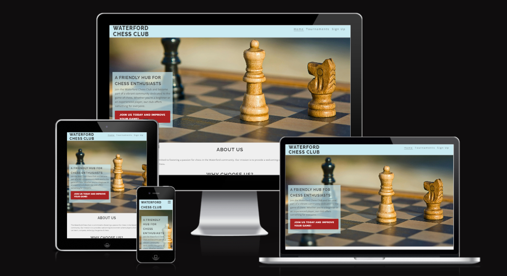

## Introduction

Waterford Chess Club is a local community website designed to unite chess enthusiasts in the Waterford area. The primary purpose of this platform is to organize events, recruit new members, and provide information on club activities. Waterford Chess Club aims to promote the game of chess, foster a sense of community, and offer members opportunities to enhance their skills through regular meetups, tournaments, and online resources. Whether you are a seasoned player or a beginner, Waterford Chess Club offers a welcoming environment for all skill levels.

### Features 

### Navigation bar :

- Featured on all pages, the navigation bar includes links to the Home, Tournaments and Sign Up pages. This ensures users can easily navigate the site on any device.
- It provides a dropdown menu on mobile devices.

**Desktop** : 

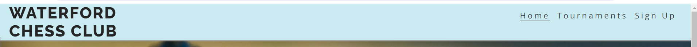

**Mobile** :

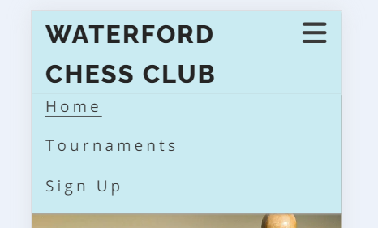

### Footer :
- The footer includes links to the club's social media pages which opens in a new tab.
- Footer is present on every page

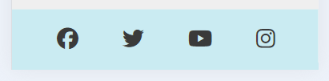

### Hero section :

- The hero section on the homepage features an engaging image and a brief welcome message. It sets the tone for the site and invites visitors to explore more about the club.
- It includes prominent call-to-action button, directing users to sign-up page.

**Desktop** :

**Mobile** :

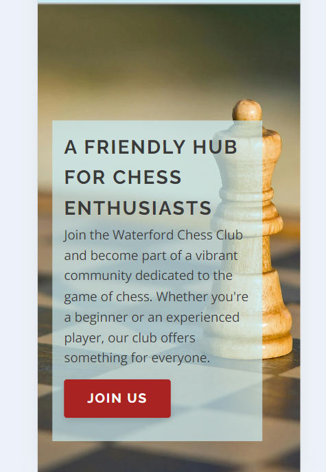

### About Us section :

- The About Us section shows the purpose of the website, so the user can determine if this is useful for him within the first few minutes.

### Contact Us :

- The contact page includes a form for users to send inquiries, as well as the club’s contact details. This ensures users can easily reach out with questions or feedback.
- It offers multiple contact options.

**Desktop** :
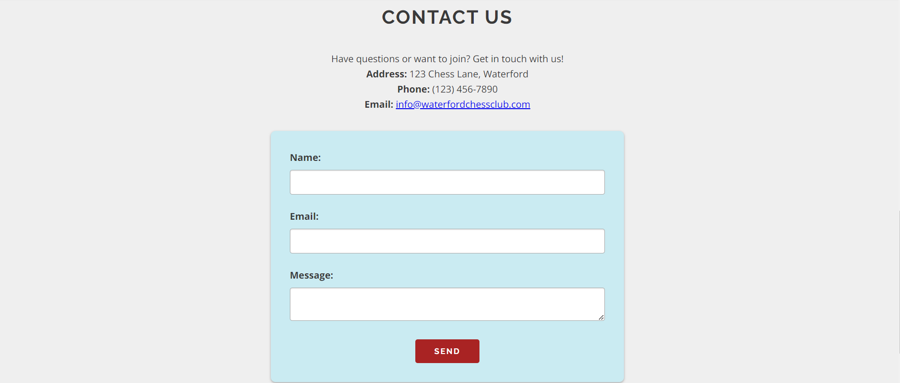

**Mobile** :
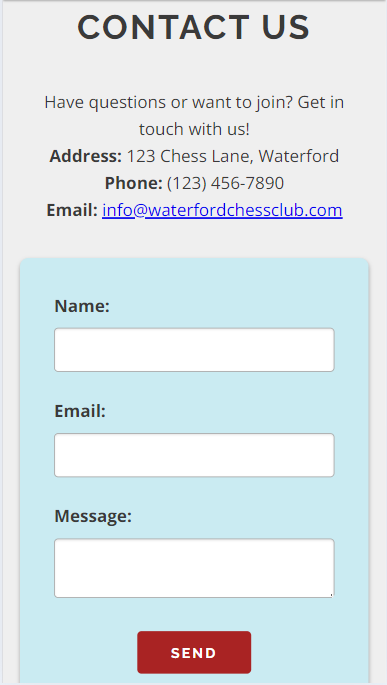

### Tournaments page

- A dedicated form for members to register for upcoming tournaments. This feature simplifies the registration process and helps the club manage event participation efficiently.
- This section displays the results of past tournaments. It keeps members informed and celebrates their achievements.

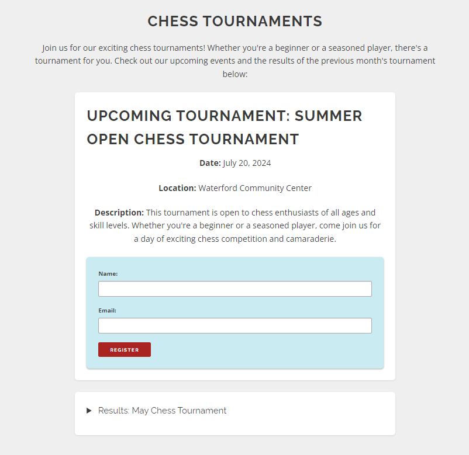
### Sign Up page

- The sign-up page allows new members to join the Waterford Chess Club by providing their personal information. This feature is crucial for growing the club's membership and community.

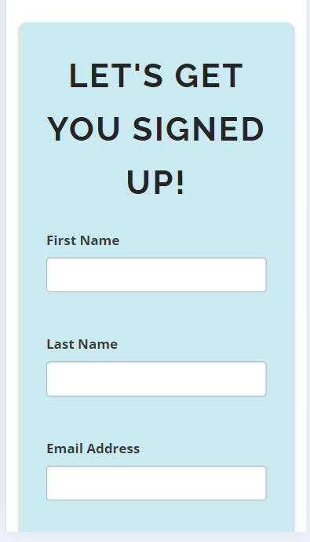
## Testing

### Manual testing

- Navigation bar :
    - Navigation bar is fully responsive on large/medium/small resolutions.
    - Navigation bar toggles to a hamburger menu on mobile devices and stays fully responsive.
    - All links to pages are working properly.
    - Hover CSS is correctly working. (Available on desktop only)

- Footer :
    - Footer is fully responsive on large/medium/small resolutions.
    - Social media links are working and opening in a new tab.

- Hero image :
    - Image is succesfully changing for a different size devices.

- Contact form links :
    - Links located in the introduction section on a main page and in the new cocktails section are both working properly.

- Contact form :
    - The form is working as intended.
    - The form is successfully sending request.
    - Submit button is working correctly. 
    - The form is looking good on all size devices.

#### Devices used during testing:

- Desktop Computer
- Android 13 device
- Chrome dev tools emulator 

### Browser Testing

During development, webpage was mainly tested on Google Chrome. 
However, during testing process below browsers have been used :

- Google Chrome
- Microsoft Edge
- Mozilla Firefox
- Safari

### Validation

[HTML validator](https://validator.w3.org/)

- 0 errors
- 0 warnings

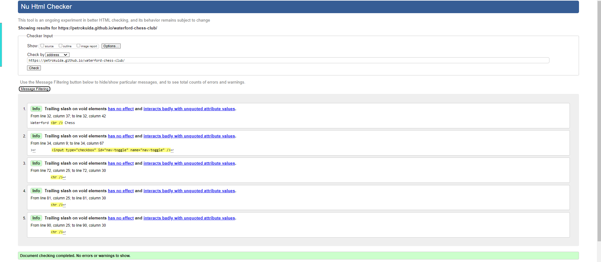

[CSS validator](https://jigsaw.w3.org/css-validator/)

- 0 errors
- 0 warnings

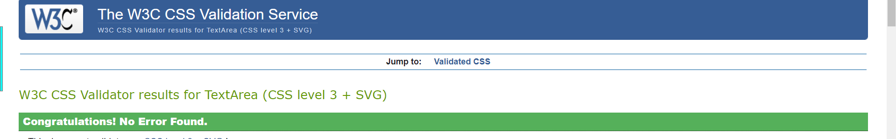

### Bugs and Fixes

### Un-resolved Bugs

- There is no un-resolved bugs

## Credits

### Images :

- Image for Hero section taken from:
https://www.pexels.com/photo/brown-and-black-wooden-chess-piece-163427/

### Code :

- [Code Institute, Love running project](https://github.com/Code-Institute-Solutions/Love-Running-Solutions) :
    - Inspiration for nav-bar, footer.

- [Font Awesome](https://fontawesome.com/) :
    - Used for all icons across the website.

### Text
- Text content was generated with the assistance of the chatGPT

### Fonts
- Google Fonts: Open Sans and Raleway